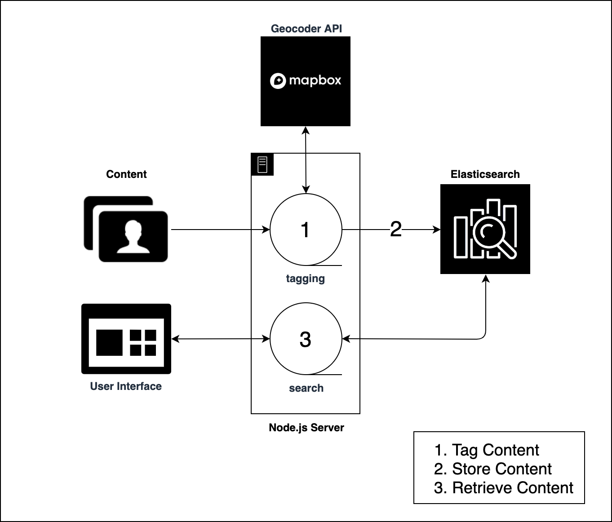
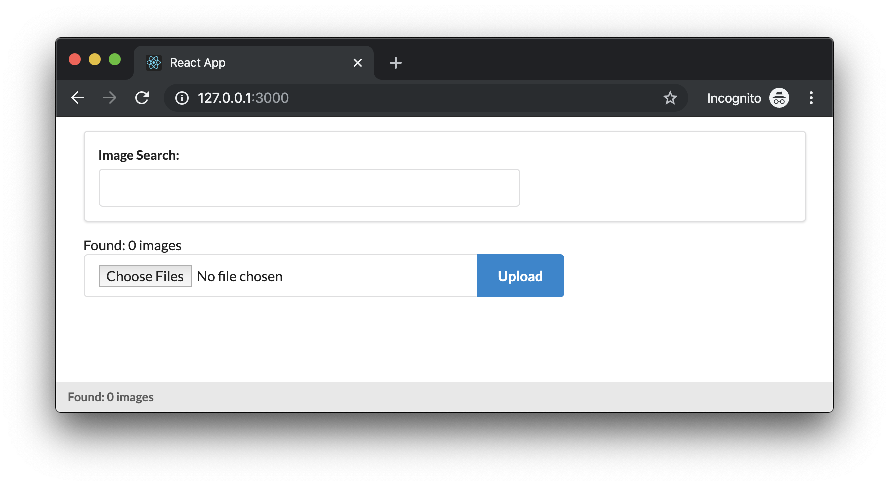
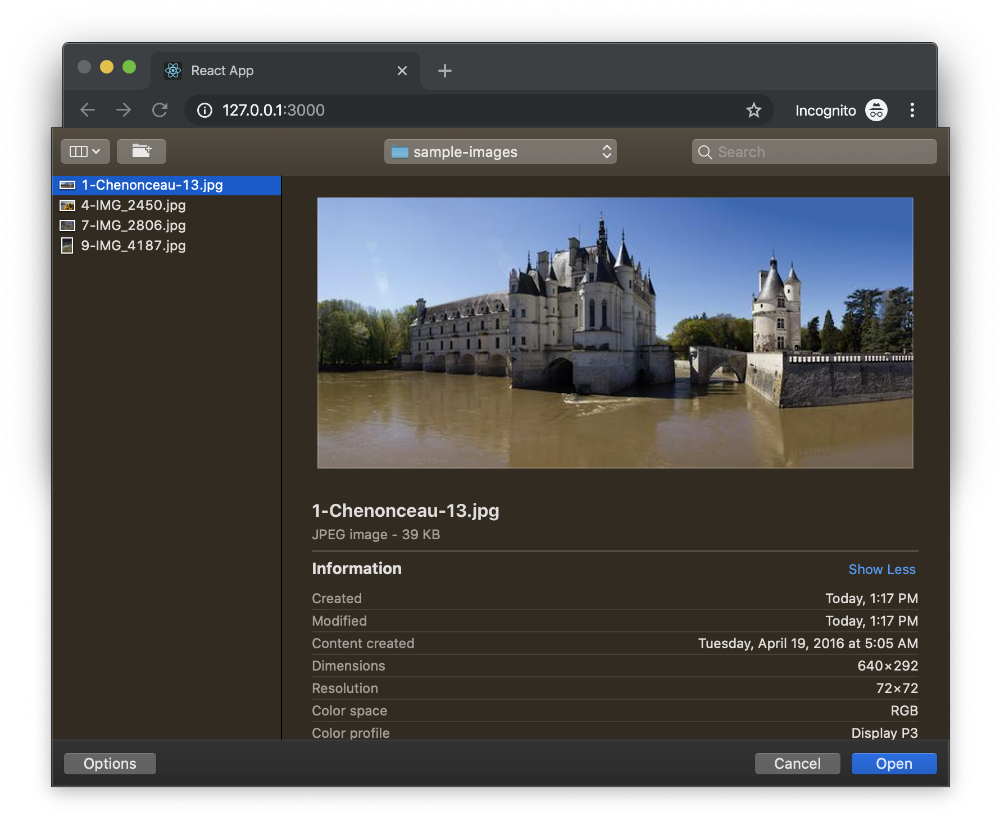
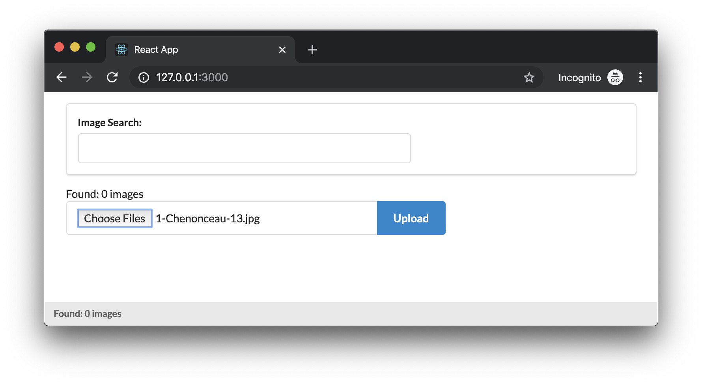
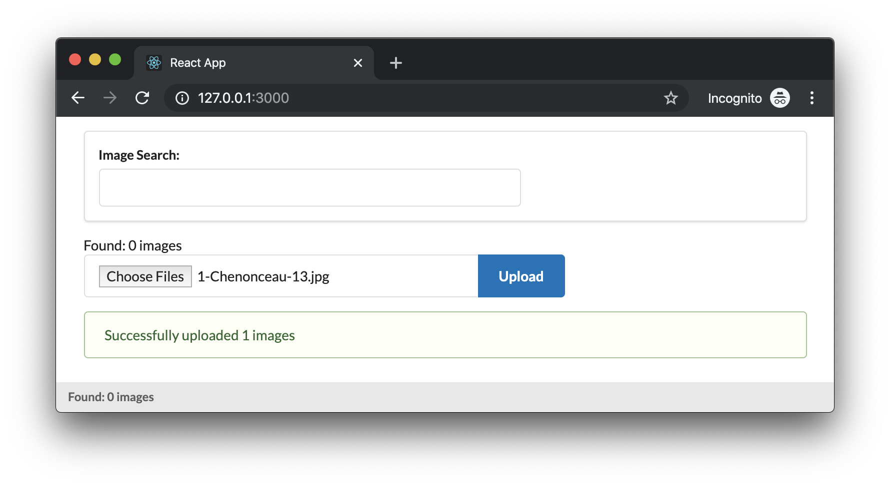
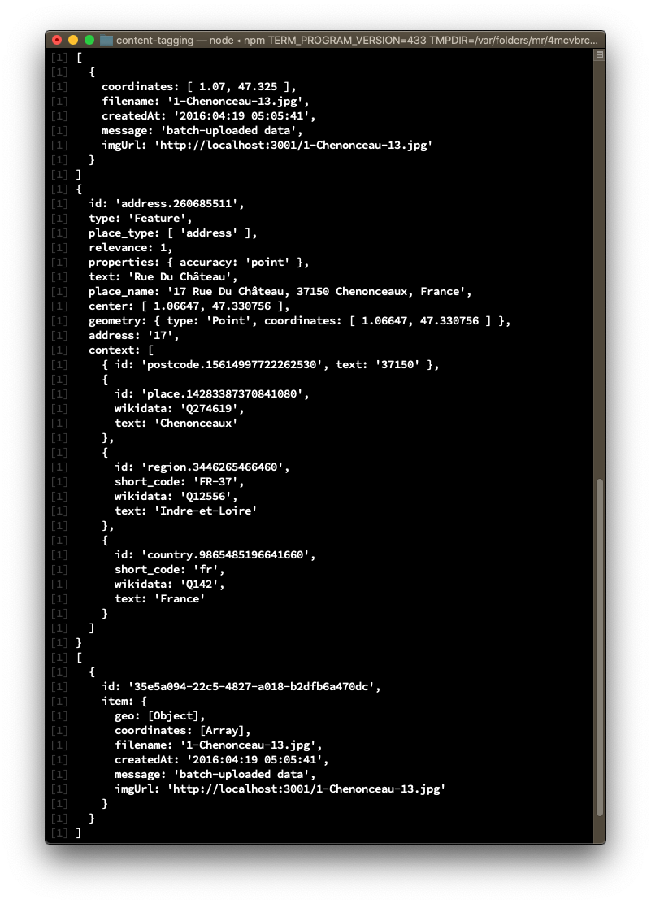
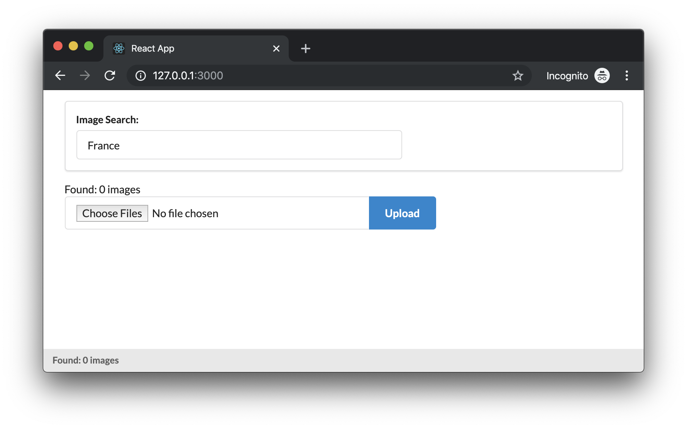
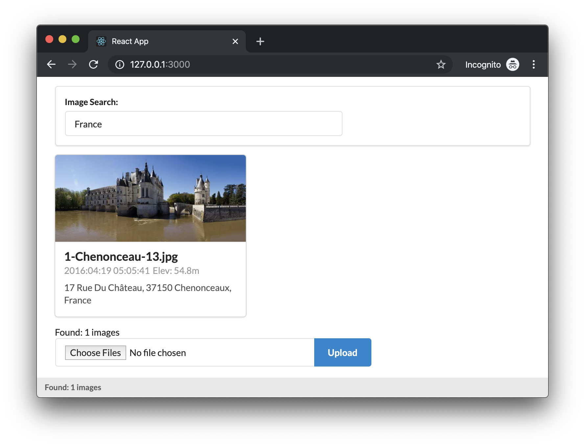

# Content Tagging

This Solution Architecture provides an easy-to-use template to tag your content with location context, store it, and then retrieve it based on end-user searches. This solution is comprised of two applications, a Node.js API server that handles content ingestion and search, and a UI frontend to upload and visually display content that has been indexed.

<!-- TOC -->

- [Content Tagging](#content-tagging)
  - [Requirements](#requirements)
    - [Node](#node)
    - [Docker](#docker)
    - [Elasticsearch](#elasticsearch)
    - [Mapbox](#mapbox)
    - [Configuration](#configuration)
  - [Development](#development)
    - [Installation](#installation)
    - [Starting Elasticsearch with Docker](#starting-elasticsearch-with-docker)
    - [Starting the Application](#starting-the-application)
    - [Uploading Images](#uploading-images)
    - [Searching](#searching)
  - [Deployment & Customization](#deployment--customization)
    - [Enhanced Tagging](#enhanced-tagging)
    - [Tuning Elasticsearch](#tuning-elasticsearch)
  - [Authors](#authors)
  - [License](#license)

<!-- /TOC -->

## Requirements

To begin development you will need the following:

### Node

You will need to have Node v8.10+ [installed](https://nodejs.org/en/download/) to run this solution.

### Docker

For development purposes only you will need to have [Docker installed](https://docs.docker.com/v17.09/engine/installation/). This is used to run the default Elasticsearch instance that will power indexing and search.

### Elasticsearch

For production use, or if you do not wish to use Docker, you must install Elasticsearch v7+. For instructions on installing Elasticsearch in your environment, [consult the Elasticsearch documentation](https://www.elastic.co/downloads/elasticsearch).

For development, this dashboard will run a Dockerized version of Elasticsearch Basic edition. This is free-to-use and features are documented on the [Elastic website](https://www.elastic.co/subscriptions). Mapbox will not provide Elasticsearch support.

### Mapbox

You will need a Mapbox public token with access to the Mapbox Permanent Geocoding API. If you do not have a Mapbox account sign up [here](https://mapbox.com/signup). If you don’t have access to the `mapbox.places-permanent` endpoint for permanent geocoding, [contact Mapbox sales](http://mapbox.com/solutions/content-tagging) to request access.

### Configuration

Once you have secured access to the Permanent Geocoding API, add your Mapbox access token to the environment. You can do this in two ways: either export the access token as an environment variable or create a `.env` file with all your configuration variables. For an example of how to structure your `.env` file, see `sample.dotenv` in the repository.

The configuration variables available:

- `MAPBOX_ACCESS_TOKEN`: **Required**
- `ELASTIC_URL`: _Optional_, defaults to `localhost:9200`. If you have your own Elasticsearch cluster set the url here

## Development

### Installation

Clone the repository and install dependencies for the server and UI starting in the repository root:

    % npm ci
    % cd ui && npm ci

### Starting Elasticsearch with Docker

Before starting up the server you’ll need to start a docker container with Elasticsearch. You can do this with a default Elasticsearch configuration in a fresh container with this command, run from the project root:

    % npm run-script docker

To start start from a fresh index, restart the docker container and all data will be cleared (uploaded images will remain in `/public`). In a production environment, [use snapshots to prevent data loss](https://www.elastic.co/guide/en/elasticsearch/reference/current/modules-snapshots.html) in the event of a stopped Elasticsearch process.

### Starting the Application

In a new terminal window, start both the user interface and server from the project root by running:

    % npm start

You will see the react application and development server start with live-reload enabled

    > @ start /content-tagging
    > cd ui && npm start
    > pics@0.1.0 start /content-tagging/ui
    > SKIP_PREFLIGHT_CHECK=true concurrently "react-scripts start" "cd .. && nodemon server/app.js "
    \[1\] [nodemon] 1.19.4
    \[1\] [nodemon] to restart at any time, enter rs
    \[1\] [nodemon] watching dir(s): .
    \[1\] [nodemon] watching extensions: js,mjs,json
    \[1\] [nodemon] starting node server/app.js
    [1] This is Listening on 3001
    [0] Starting the development server...

This will also a browser window with the UI loaded at `http://localhost:3000` . You should see an `Image Search` form, and a `File Upload` control as seen below.

### Uploading Images

Start with uploading an image. From the browser click `Choose Files`, and select a sample image encoded with EXIF GPS information from the `sample-images` folder.

In this example, we are using `chenonceau.jpg` , which was taken in France. The client application POSTs the image to the `/upload` endpoint (see `server/upload.js`) which does several things:

1. Uploads the image to the `/public` folder. To modify where images are stored see [upload.js:7](https://github.com/mapbox/content-tagging/blob/master/server/upload.js#L7)
2. Extracts geographic coordinates from the image's EXIF tags.
3. Calls the ingest function, defined in `server/ingest.js`.
4. The ingest function calls the Mapbox Geocoding and Raster Tiles APIs to add location and elevation metadata
5. Inserts a reference to the image along with all metadata into Elasticsearch for indexing. Since this is our first piece of content, Elasticsearch automatically creates a new index with default mappings. Read more about how to [customize Elasticsearch mappings here](https://www.elastic.co/guide/en/elasticsearch/reference/current/mapping.html).

Upon completion, a status box will appear indicating that the image was successfully uploaded.

In the terminal, you will see the results of the ingest function requesting geographic and elevation data from Mapbox.

### Searching

Once you have the image uploaded, from the Image Search form, type in “France” or “Chenonceau”. To view all uploaded images search for “\*”. The interface passes the search query to the `/search` endpoint (see `server/search.js` for more) which performs a basic full-text search of our Elasticsearch index.

Press return and the image you uploaded appears.

## Deployment & Customization

### Enhanced Tagging

There are several ways to augment and extend this solution for production including enhanced tagging:

- Tag content using custom geometry like regions or service areas using the [Mapbox TileQuery API](https://docs.mapbox.com/api/maps/#tilequery).
- Put text documents on the map — tag location extracted from text documents like news articles or ancestral records using forward geocoding.

This logic would be [added to the `processItem` function](https://github.com/mapbox/content-tagging/blob/master/server/ingest.js#L55) found in `server/ingest.js`

### Tuning Elasticsearch

There are many ways to further tune Elasticsearch to return more relevant search results. First, consider mappings, which define how a piece of content and the fields it contains, are stored and indexed. Read more about how to [customize Elasticsearch mappings in the Elasticsearch docs](https://www.elastic.co/guide/en/elasticsearch/reference/current/mapping.html).

A second is to customize the query structure, found in `server/search.js` to do things like only searching certain fields such as Address or Country. Read more about how to construct [Elasticsearch queries in the Elasticsearch docs](https://www.elastic.co/guide/en/elasticsearch/reference/current/query-dsl.html).

Lastly, running Elasticsearch in the cloud makes it easy to deploy, operate, and scale.
There are also several options including [Elastic.co](elastic.co) and [AWS](https://aws.amazon.com/elasticsearch-service/)

## Authors

Mapbox Solutions Architecture

## License

This project is licensed under the BSD-3-Clause License - see the \[LICENSE.md\](LICENSE) file for details
